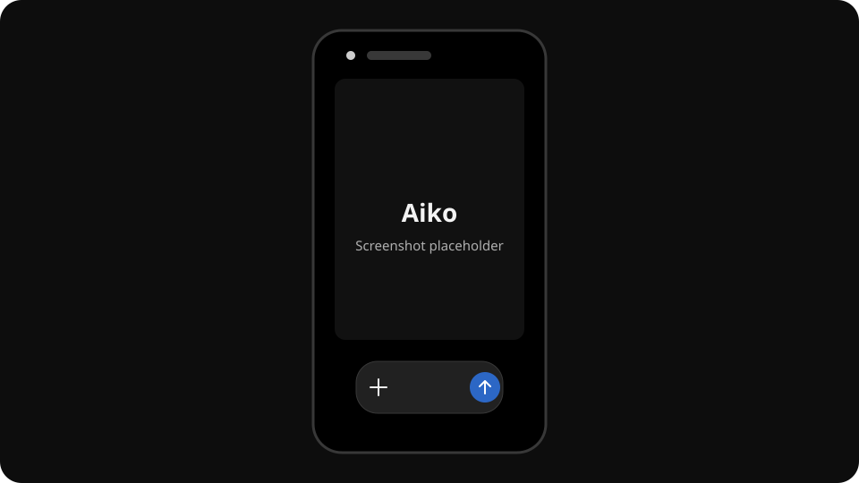

# Aiko — Offline Fake-AI Chat Demo

> **Important:** Aiko is a **fake AI / demo**. It does not contain a language model, does not call an AI service, and makes **no network requests at runtime**. Its replies come from configurable rules and deterministic offline tools.

> **Wichtig:** Aiko ist eine **Fake-KI / Demo**. Die App enthält kein Sprachmodell, ruft keinen KI-Dienst auf und sendet **zur Laufzeit keine Netzwerkanfragen**. Antworten stammen aus konfigurierbaren Regeln und eingebauten Offline-Werkzeugen.



## English

Aiko recreates the mobile ChatGPT web-chat experience as a completely client-side React application. It is intended for demonstrations, prototypes, scripted conversations, and offline use. Existing data from the original single-file app remains compatible through the `nova.*` localStorage keys.

### Features

- Mobile-first ChatGPT-style interface with light, dark, and system themes
- Realistic local chat history, response streaming, regeneration, editing, feedback, sharing, and text-to-speech
- Configurable response rules with exact, fuzzy, regex, capture, AND, exclusion, priority, variation, suggestion, and follow-up syntax
- Verbatim rule-code prompt, validated multi-rule import, rule editor, rule tests, and JSON import/export
- Offline math engine for expressions, percentages, fractions, equations, and Unicode minus signs
- Unit and fixed-rate currency conversion, dates, calendar weeks, time zones, finance, geometry, and rule-of-three calculations
- Offline knowledge search, dictionary, memory, and meta answers
- Persistent timers with pause/resume controls and the compact SVG timer dock
- Interactive checklists, QR codes, charts, passwords/PINs, random tools, text tools, and 29 slash-menu commands plus nine command groups
- Local profile image handling, dynamic Aiko branding, chat export, and complete backups
- No backend, CDN, webfont, analytics, or runtime API dependency

## Deutsch

Aiko bildet das mobile Web-Chat-Erlebnis von ChatGPT als vollständig clientseitige React-App nach. Die Anwendung eignet sich für Demos, Prototypen, vorgegebene Gespräche und Offline-Nutzung. Bestehende Daten der ursprünglichen Einzeldatei-App bleiben über die localStorage-Schlüssel `nova.*` kompatibel.

### Funktionen

- Mobile ChatGPT-nahe Oberfläche mit hellem, dunklem und System-Design
- Lokaler Chatverlauf, Streaming-Optik, Neugenerieren, Bearbeiten, Feedback, Teilen und Vorlesen
- Konfigurierbare Regeln mit exakten, unscharfen, RegEx-, Capture- und UND-Mustern sowie Ausschlüssen, Prioritäten, Varianten, Vorschlägen und Folgeantworten
- Wortgleich übernommener Regel-Prompt, validierter Mehrfachimport, Regel-Editor, Regeltests und JSON-Import/-Export
- Offline-Mathematik für Ausdrücke, Prozent, Brüche, Gleichungen und Unicode-Minuszeichen
- Einheiten und feste Offline-Währungskurse, Datum, Kalenderwochen, Zeitzonen, Zinsen, Geometrie und Dreisatz
- Offline-Wissenssuche, Wörterbuch, Merkzettel und Meta-Antworten
- Persistente Timer mit Pause/Fortsetzen und einklappbarem SVG-Timer-Dock
- Interaktive Checklisten, QR-Codes, Diagramme, Passwörter/PINs, Zufalls- und Textwerkzeuge sowie 29 Slash-Menü-Befehle plus neun Befehlsgruppen
- Lokales Profilbild, dynamischer Aiko-Markenname, Chat-Export und vollständige Backups
- Kein Backend, keine CDNs, keine Webfonts, kein Tracking und keine Laufzeit-API

## Local development / Lokal starten

Requirements: Node.js 20.19+ (or 22.12+) and npm.

```bash
npm install
npm run dev
```

Vite prints the local address. The app stores configuration and chats only in the browser.

## Build and checks / Build und Prüfungen

```bash
npm run typecheck
npm test
npm run build
npm run preview
```

The static production build is written to `dist/` and can be hosted on any static web server.

### GitHub Pages

A ready-to-use workflow template is stored at [`docs/pages.yml`](docs/pages.yml). Copy it to GitHub's workflow directory when you want to enable deployment:

```bash
mkdir -p .github/workflows
cp docs/pages.yml .github/workflows/pages.yml
```

Commit the copied file and select **GitHub Actions** as the Pages source in the repository settings. The workflow validates, builds, and deploys every push to `main`.

Eine fertige Workflow-Vorlage liegt unter [`docs/pages.yml`](docs/pages.yml). Kopiere sie bei Bedarf wie oben nach `.github/workflows/pages.yml`, committe die Datei und wähle in den Repository-Einstellungen für Pages **GitHub Actions** als Quelle.

## Project structure / Projektstruktur

```text
src/
├── components/       React UI (Chat, Sidebar, Settings, TimerDock, CodeImport …)
├── data/             Default configuration, commands, verbatim RULE_CODE_DOC
├── engine/           Offline response engine, parser, NovaMath and QR logic
├── hooks/            React/localStorage/chat/timer state
├── test/             Engine and UI behaviour checks
├── types.ts          Rules, config, chats, messages, timers and lists
└── styles.css        Responsive mobile light/dark design
```

The uploaded `ai21.html` is retained as the original migration reference. The React app is served from the root `index.html`.

## Privacy and limitations / Datenschutz und Grenzen

All chat content, rules, lists, timers, profile data, and settings stay in the current browser unless the user explicitly exports a file or uses the browser share feature. Aiko cannot retrieve current information and can be wrong; important information should always be checked.

Alle Chats, Regeln, Listen, Timer, Profildaten und Einstellungen bleiben im aktuellen Browser, sofern nicht ausdrücklich eine Datei exportiert oder die Teilen-Funktion des Browsers verwendet wird. Aiko kann keine aktuellen Informationen abrufen und kann Fehler machen; wichtige Angaben sollten immer geprüft werden.

## License / Lizenz

Released under the [MIT License](LICENSE). / Veröffentlicht unter der [MIT-Lizenz](LICENSE).
