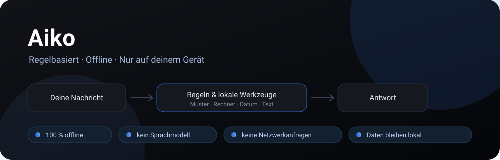

# Aiko — regelbasierter Offline-Chat

**Ein Chat-Assistent, der vollständig auf dem Gerät läuft – nach festen Regeln, ohne Sprachmodell und ohne Internet.**

Aiko sieht aus wie eine moderne Chat-App, ist aber bewusst etwas anderes: ein Programm, das nach Regeln arbeitet. Jede Antwort kommt entweder aus einer Regel, die du selbst geschrieben hast, oder aus einem eingebauten lokalen Werkzeug, das wirklich rechnet. Kein Server, kein Konto, keine Netzwerkanfrage.



🇩🇪 Deutsch (diese Seite) · [🇬🇧 English](#english)

---

## Warum Aiko so gebaut ist

Aiko ist **keine KI im Sinne eines Sprachmodells** – und das ist Absicht, kein Mangel. Die App ist ein transparenter Regel- und Werkzeugkasten mit Chat-Oberfläche:

| Eigenschaft | Was das konkret heißt |
| --- | --- |
| **Nachvollziehbar** | Jede Antwort hat eine Ursache: eine Regel, ein Werkzeug oder eine Fallback-Antwort. Nichts entsteht aus einem undurchsichtigen Modell. |
| **Vorhersehbar** | Gleiche Eingabe, gleiche Regel → gleiche Antwort. Zufall gibt es nur dort, wo er gewollt ist (Würfeln, Passwort, Zufallszahl). |
| **Offline** | Die gebaute App läuft ohne Backend, ohne CDN und ohne Webfonts. Einmal geladen, funktioniert sie auch im Flugmodus. |
| **Privat** | Chats, Regeln, Listen, Timer und Einstellungen bleiben im `localStorage` des Browsers. Es gibt keinen Kanal, über den Inhalte das Gerät verlassen könnten. |
| **Anpassbar** | Du bestimmst die Antworten: Regeln schreiben, importieren, exportieren, testen – direkt in den Einstellungen. |
| **Winzig** | Eine statische Web-App aus wenigen Dateien: kein Modell-Download, keine Laufzeit-Abhängigkeiten, keine Kosten pro Anfrage. |

**Was Aiko ausdrücklich nicht ist:** ein Sprachmodell, ein Chatbot mit Weltwissen, eine Suchmaschine. Aiko kennt keine aktuellen Nachrichten, löst keine freien Textaufgaben und erfindet nichts. Passt keine Regel und ist kein Werkzeug zuständig, sagt Aiko das ehrlich – statt sich etwas auszudenken.

> **Die Oberfläche ist an mobile Chat-Apps angelehnt – der Inhalt nicht.** Die Antwortmodi **Standard**, **Schnell** und **Denkpause** ändern nur Tippgeschwindigkeit und Antwortpausen. Jede Antwort stammt aus derselben Regel-Engine. Streaming-Optik, Denk-Pause und Vorschlags-Buttons sind Darstellung, keine Berechnung.

---

## So entsteht eine Antwort

Jede Nachricht läuft in dieser Reihenfolge durch die Engine (siehe [`src/engine/aikoEngine.ts`](src/engine/aikoEngine.ts)):

1. **`/`-Befehl?** Dann hat der Befehl Vorrang, z. B. `/timer 5 Minuten`.
2. **Folgeantwort?** „kürzer“, „warum?“, „ein Beispiel?“, „und mal 2“ – Aiko bezieht sich auf die vorherige Antwort.
3. **Regel mit Priorität oder exakter Treffer** – gewinnt sofort.
4. **Lokale Werkzeuge** – Einheiten, Datum, Timer, Listen, QR, Passwort, Diagramme, Text-Werkzeuge …
5. **Regel ohne Priorität** – normales Stichwort, tippfehlertolerant.
6. **Offline-Rechner** – `23 × 17`, `20 % von 150`, `2x + 3 = 11`.
7. **Meta-Antworten** – z. B. Fragen nach den eigenen Fähigkeiten.
8. **Wissenssammlung** – deine eigenen Notizen/FAQ, mit Angabe der Quelle.
9. **Fallback** – eine freundliche Standardantwort, wenn nichts passt.

---

## Was Aiko wirklich kann

### Regeln & Gespräch

- Vier Auslöser-Typen: normale Phrasen (tippfehlertolerant), `=exakt`, `~/regex/flags` und `{platzhalter}` zum Übernehmen von Text
- UND-Verknüpfung mit `&`, Ausschlüsse (`nicht bei: …`), Prioritäten, aktiv/inaktiv
- Antwortvarianten (mit `|||` getrennt), Vorschlags-Buttons und Folgeantworten für „kürzer“, „einfacher“, „warum“, „beispiel“, „mehr“, „nochmal“
- Regel-Editor, Regel-Code-Import mit Validierungsfehlern, Regel-Testsuite, Nutzungsstatistik, JSON-Import/-Export
- Chat-Komfort: Neugenerieren, Varianten wechseln, Nachrichten bearbeiten, Feedback, Teilen, Vorlesen, Verlauf anpinnen und umbenennen

### Werkzeuge, die echte Ergebnisse liefern

- **Rechner:** Grundrechenarten, Klammern, Potenzen, Wurzeln, Fakultät, Modulo, Prozentwert/Prozentsatz, Rabatt und Aufschlag, Gleichungen mit `x` bis Grad 2 inklusive Rechenweg
- **Einheiten & Währung:** Länge, Masse, Volumen, Fläche, Temperatur, Datenmengen und mehr; Währungen mit fest hinterlegten Kursen (Kursstand steht in der Antwort)
- **Datum & Uhrzeit:** Wochentag, Kalenderwochen, Zeiträume, Alter und nächster Geburtstag, Countdowns, Zeitunterschiede und Uhrzeit-Umrechnung
- **Finanzen & Alltag:** Zinseszins, Netto/Brutto, Preisvergleich, Dreisatz, Geometrie
- **Timer & Wecker:** echter Countdown mit Dock zum Pausieren, Fortsetzen und Abbrechen
- **QR-Codes:** eigener Encoder, offline erzeugt und scannbar – auch WLAN-QR-Codes
- **Diagramme & Listen:** Säulen-, Torten- und Liniendiagramme, interaktive Checklisten
- **Zufall & Sicherheit:** Passwörter, PINs, Würfeln, Münzwurf, Zufallszahl, Entscheidungshilfe
- **Text-Werkzeuge:** sortieren, mischen, Duplikate entfernen, Groß-/Kleinschreibung, umkehren, JSON formatieren und prüfen, Wörter zählen
- **Zahlen & Farben:** Zahlensysteme, Primfaktoren und Primzahltest, Farbumrechnung
- **Wissen:** Deutsch-Englisch-Wörterbuch (erweiterbar), Merkzettel/Erinnerungen, eigene Wissenssammlung
- **29 Slash-Befehle** plus Kurzformen in 9 Themengebieten – Übersicht im Chat mit `/hilfe`

### Verwaltung & Datenschutz im Alltag

- Helles, dunkles und System-Design, mobile-first, Animationen reduzierbar
- Eigener Name und Name des Assistenten frei wählbar, Profilbild wird lokal skaliert
- Chats anpinnen, umbenennen, löschen, temporär (nicht gespeichert) schalten
- Chat als Markdown exportieren, komplettes Backup als JSON sichern und wiederherstellen
- Daten der ursprünglichen Einzeldatei-App bleiben über die `nova.*`-Schlüssel kompatibel

---

## Regeln schreiben

Regeln sind reiner Text – entweder im Editor oder als Regel-Code:

```text
regel: wie alt bist du | dein alter | deine version
antwort: Jahre zähle ich nicht – ich bin ein regelbasiertes Programm. ||| Ich bin so alt wie diese Version: ein Programm, das nach Regeln läuft. 🙂
vorschlag: Was kannst du? | Erzähl mir einen Witz
priorität: 0
nicht bei: alter, altes
folge kürzer: Ich bin ein Programm nach Regeln – mehr nicht.
folge warum: Weil meine Antworten aus Regeln stammen, nicht aus einem Modell.
aktiv: ja
```

`regel:` und `antwort:` sind Pflicht, alles andere optional; `---` trennt mehrere Regeln, `#` beginnt einen Kommentar. Vorschlags-Buttons (`vorschlag:`) schicken ihren Text beim Antippen als neue Nachricht – sie ergeben nur Sinn, wenn es für diese Fragen bereits eine Regel gibt, sonst endet der Klick in einer Ausweichantwort.

Im **Code-Einfügefeld der Einstellungen** werden gültige Regeln sofort auf mögliche Konflikte mit vorhandenen Regeln und untereinander geprüft. Die Hinweise nennen die betroffenen Regeln, eine Beispielfrage und die dabei gewinnende Regel. Die Prüfung nutzt dasselbe Matching wie der Chat, inklusive Priorität, exakten Treffern, Tippfehler-Toleranz und Ausschlüssen, ohne etwas zu speichern oder Werkzeuge auszuführen. Bei Konflikten muss der Import ausdrücklich bestätigt werden; vorhandene Regeln werden nicht gelöscht oder ersetzt. RegEx werden gegen die Beispielfragen geprüft, identische RegEx-Muster zusätzlich direkt erkannt. Überschneidungen beliebiger unterschiedlicher RegEx können unentdeckt bleiben.

Ein Klick auf **„Antworten festlegen“** klappt nur die vorhandene Regelliste ein oder aus. **„Neue Regel“**, **„Alle Regeln testen“**, die Code-Vorlage und das Einfügefeld bleiben auch bei eingeklappter Liste verfügbar.

Regel-Code kann auch direkt im Chat gesendet werden. Sobald eine Nachricht mit `regel:` beginnt, prüft Aiko den Code, fügt gültige Regeln hinzu und bestätigt die Anzahl der importierten Regeln. Bei Fehlern wird nichts übernommen und Aiko zeigt die betroffenen Zeilen an:

```text
regel: =hallo
antwort: Hallo {name}! Wie kann ich helfen?
```

**Tipp:** In den Einstellungen liegt unter *Code-Format – für eine KI kopieren* ein fertiger Prompt ([`src/data/ruleCodeDoc.ts`](src/data/ruleCodeDoc.ts)). Du kannst ihn in eine KI deiner Wahl einfügen und dir daraus Regel-Code erzeugen lassen, den du entweder über *Regel-Code importieren* oder direkt im Chat einsetzt. Der Prompt weist die KI ausdrücklich an, **keine `vorschlag:`-Zeilen** zu erzeugen: Für die Button-Texte gäbe es noch keine Regel, ein Klick darauf würde in einer Ausweichantwort enden. Vorschlags-Buttons kannst du bei Bedarf selbst im Editor ergänzen. Wichtig: Aiko selbst sendet dabei nichts – dieser Umweg passiert außerhalb der App und ist deine Entscheidung. Ungültige Zeilen werden beim Import einzeln gemeldet, statt still zu verschwinden.

---

## Schnellstart

Voraussetzungen: Node.js 20.19+ (oder 22.12+) und npm.

```bash
npm install
npm run dev
```

Vite gibt die lokale Adresse aus. Einstellungen, Regeln und Chats werden ausschließlich im Browser gespeichert.

### Skripte

| Befehl | Zweck |
| --- | --- |
| `npm run dev` | Entwicklungsserver mit Hot Reload |
| `npm run typecheck` | TypeScript prüfen (ohne Ausgabe) |
| `npm test` | Vitest-Suite: Engine, Werkzeuge, Oberfläche |
| `npm run build` | Typprüfung + statischer Build nach `dist/` |
| `npm run preview` | gebauten Stand lokal ausliefern |

`dist/` ist eine rein statische Seite und läuft auf jedem Webspace, hinter jedem Reverse-Proxy oder komplett lokal. Im Produktions-Build registriert Aiko zusätzlich einen Service Worker und kann als installierbare PWA genutzt werden. Nach dem ersten Laden bleibt die App auch beim nächsten Aufruf ohne Netz verfügbar. Neue Dateien werden in einem eigenen, inhaltsbasiert versionierten Cache vorbereitet; ein laufender Chat wird nicht ungefragt ersetzt. Ist ein Update bereit, kann es über den Hinweis „Jetzt neu laden“ übernommen werden, andernfalls nach dem Schließen aller alten App-Fenster.

### GitHub Pages

Der Workflow unter [`.github/workflows/pages.yml`](.github/workflows/pages.yml) prüft bei jedem Push auf `main` Typen, Tests und Build und deployt danach den gebauten Stand. Als Pages-Quelle in den Repository-Einstellungen **GitHub Actions** wählen. Eine identische Vorlage zum Kopieren liegt unter [`docs/pages.yml`](docs/pages.yml).

Für den GitHub-Bereich **About** (Repository-Einstellungen): Beschreibung „Regelbasierter Offline-Chat-Assistent mit lokalen Werkzeugen und eigenen Regeln – ohne Sprachmodell, Backend oder Tracking.“; Website `https://hpmine42.github.io/Aiko/`; Topics `offline`, `chatbot`, `rule-based`, `privacy`, `local-first`, `react`, `typescript`, `german`.

---

## Projektstruktur

```text
src/
├── components/   React-Oberfläche (Chat, Sidebar, Einstellungen, TimerDock, CodeImport …)
├── data/         Standardregeln, Slash-Befehle, RULE_CODE_DOC-Prompt für KIs (ohne „vorschlag:“)
├── engine/       Antwort-Engine, Rechner (NovaMath), Regel-Parser, QR-Encoder
├── hooks/        Zustand für Chats, Timer, localStorage, Dialoge, Toasts
├── utils/        Export, Teilen, Zwischenablage, Bildskalierung, Konfigurations-Normalisierung
├── test/         Engine- und UI-Tests
├── types.ts      Regeln, Konfiguration, Chats, Nachrichten, Timer, Listen
└── styles.css    responsives Hell-/Dunkel-Design
```

Ausgeliefert wird die React-App über die Wurzel `index.html`; die frühere Einzeldatei-App ist nicht mehr Teil des Projekts.

---

## Datenschutz im Detail

- **Keine Chat-Anfragen an einen Server:** Antworten entstehen lokal. Der Service Worker lädt ausschließlich Dateien derselben Website für Updates und Offline-Nutzung; es gibt keine Analytics, CDNs oder externen Fonts/Bilder.
- **Speicherung:** `nova.config.v2`, `nova.chats.v2`, `nova.timers.v2`, `nova.ui.v2`, `nova.theme.v2` im `localStorage` des Browsers. Alte `.v1`-Schlüssel werden beim Laden normalisiert migriert und erst nach erfolgreichem Speichern entfernt.
- **Diktieren ist optional:** Die Browser-Spracherkennung ist zunächst deaktiviert. Beim Aktivieren weist Aiko darauf hin, dass der Browser je nach Anbieter Audio extern verarbeiten kann. Aiko selbst sendet keine Audiodaten.
- **Dateianhänge:** Dateien werden mit Name/Größe im Chat angezeigt; Bilder erhalten eine lokale Vorschau im Browser. Aikos Antwort-Engine kann Dateiinhalte nicht lesen oder analysieren; Datei-Bytes werden weder hochgeladen noch in `localStorage` gespeichert. Beim Senden erklärt Aiko diese Grenze ausdrücklich.
- **Systemfunktionen:** Vorlesen nutzt die Stimmen des Geräts (Web Speech API), Teilen die Teilen-Funktion des Systems, Timer eine optionale Vibration.
- **Export nur auf Klick:** Backup (JSON) und Chat-Export (Markdown) entstehen ausschließlich, wenn du sie auslöst.
- **Löschen:** Browserdaten für die Seite löschen entfernt alle Aiko-Daten, inklusive Chats.
- **Hosting-Hinweis:** Die App ist eine statische Seite. Wer sie ausliefert, sieht beim Aufruf übliche Server-Logs (IP, Zeitpunkt, Datei). Chat-Inhalte werden nicht an diesen Host gesendet.

---

## Grenzen

- **Kein Allgemeinwissen:** Aiko beantwortet nur, wofür Regeln oder Werkzeuge existieren. Alles andere bekommt eine Fallback-Antwort.
- **Keine freien Textaufgaben:** Der Rechner wertet Ausdrücke aus, aber keine Sachaufgaben in Prosa.
- **Keine Aktualität:** Datum und Uhrzeit kommen vom Gerät, Währungskurse sind fest hinterlegt und können veralten.
- **Gleitkommazahlen:** Ergebnisse werden numerisch berechnet und bei Bedarf gerundet (bis 12 signifikante Stellen).
- **Lokale Daten:** Ohne Backup sind Chats und Regeln weg, wenn die Browserdaten gelöscht werden.

---

## Lizenz

Veröffentlicht unter der [MIT-Lizenz](LICENSE).

---

# English

**A chat assistant that runs entirely on your device – with fixed rules, no language model, no internet.**

Aiko looks like a modern chat app but is deliberately something else: a program that works by rules. Every reply comes either from a rule you wrote yourself or from a built-in local tool that actually computes. No server, no account, no network request.

## Why Aiko is built this way

Aiko is **not an AI in the sense of a language model** – that is intentional, not a shortcoming:

| Property | What it means |
| --- | --- |
| **Traceable** | Every reply has a cause: a rule, a tool or a fallback answer. Nothing comes out of an opaque model. |
| **Predictable** | Same input, same rule → same reply. Randomness only appears where it is wanted (dice, passwords, random numbers). |
| **Offline** | The built app needs no backend, no CDN, no web fonts. Loaded once, it keeps working in airplane mode. |
| **Private** | Chats, rules, lists, timers and settings stay in the browser's `localStorage`. There is no channel for content to leave the device. |
| **Customisable** | You decide the answers: write, import, export and test rules right inside the settings. |
| **Tiny** | A static web app made of a handful of files: no model download, no runtime dependencies, no per-request cost. |

**What Aiko explicitly is not:** a language model, a chatbot with world knowledge, a search engine. Aiko has no current information, does not solve free-form word problems and never makes things up. If no rule and no tool matches, it says so instead of inventing an answer.

> **The interface takes cues from mobile chat apps – the content does not.** The **Standard**, **Schnell** (“Fast”) and **Denkpause** (“Thinking pause”) modes only change typing speed and response delays. Every reply comes from the same rule engine; streaming, thinking pauses and suggestion chips are presentation, not computation.

## How a reply is produced

Every message passes through the engine in this order ([`src/engine/aikoEngine.ts`](src/engine/aikoEngine.ts)): `/` command → follow-up answer (“shorter?”, “why?”, “and times two”) → prioritised or exact rule → local tools (units, dates, timers, lists, QR, passwords, charts, text tools) → regular rules → offline calculator → meta answers → your own knowledge base → fallback.

## Features

- Rule triggers: plain phrases (typo tolerant), `=exact`, `~/regex/flags`, `{placeholder}` capture, `&` (AND), exclusions, priorities, enabled flag
- Multiple reply variants (`|||`), suggestion buttons, follow-ups for shorter/simpler/why/example/more/again, rule editor, validated rule-code import, rule tests and usage stats, JSON import/export
- Working offline tools: calculator with equations up to degree 2 (including working steps), unit and fixed-rate currency conversion, dates, calendar weeks, time zones, ages and countdowns, compound interest, net/gross, price comparison, rule of three, geometry
- Timers with a pause/resume dock, offline QR codes (including Wi-Fi), bar/pie/line charts, interactive checklists
- Passwords, PINs, dice, coin flips, random numbers and pickers, text tools (sort, shuffle, deduplicate, case, reverse, JSON, word count), number bases, primes, colour conversion
- German↔English dictionary plus your own, memory notes, personal knowledge base with sources
- 29 slash commands and short forms across 9 topics – type `/hilfe` in the chat
- Light/dark/system theme, avatar handling, chat pinning and renaming, Markdown chat export, full JSON backup; existing `nova.*` data from the original single-file app stays compatible

## Quick start

```bash
npm install
npm run dev      # development server
npm run typecheck
npm test
npm run build    # static output in dist/
```

Node.js 20.19+ (or 22.12+) and npm are required. `dist/` is a plain static site and can be hosted anywhere, including GitHub Pages – the workflow in [`.github/workflows/pages.yml`](.github/workflows/pages.yml) validates, builds and deploys every push to `main`. Production builds generate a content-versioned service worker. Updates are staged without interrupting an open chat; users can reload from the update notice or let the update apply after closing old app windows.

## Privacy and limits

Chat requests are never sent to a server; replies are generated locally. The service worker only fetches same-site app assets for updates and offline use. There is no analytics, CDN, external font or image. App data stays in the browser's `localStorage` (`nova.config.v2`, `nova.chats.v2`, `nova.timers.v2`, `nova.ui.v2`, `nova.theme.v2`). Legacy `.v1` keys are normalized into version 2 and removed only after the new value is saved successfully. Optional dictation starts disabled; browser speech recognition may process audio through an external provider, depending on the browser. Aiko itself never sends audio. File attachments are shown with their name and size; images get a browser-local preview. Aiko's reply engine cannot read or analyze file contents; file bytes are neither uploaded nor saved in `localStorage`. When an attachment is sent, Aiko states this limitation clearly; the texts for this are configurable in the settings, separately for images and files. Speech output uses device voices, sharing uses the system share sheet, and timers may vibrate. Files are only created when you export them; removing the site's browser data deletes app data, chats included. The hosting site receives ordinary asset-request logs, but chat content is not sent to it.

Aiko knows only what rules and tools cover: no general knowledge, no free-form word problems, no live data. Date and time come from the device, currency rates are fixed and can become outdated, and numeric results use JavaScript floating point (rounded to up to 12 significant digits). Without a backup, chats and rules are gone once the browser data is cleared.

## Projektstruktur / Project structure

`components/` React UI · `data/` default config, commands, rule-code prompt for AI (no `vorschlag:`) · `engine/` response engine, NovaMath, rule parser, QR encoder · `hooks/` chats, timers, localStorage, dialogs, toasts · `utils/` export, share, clipboard, image resize · `test/` engine and UI checks · `types.ts` shared types · `styles.css` responsive theme.

The former single-file app has been removed; the React app is served from the repository-root `index.html`.

## Lizenz / License

Released under the [MIT License](LICENSE).
